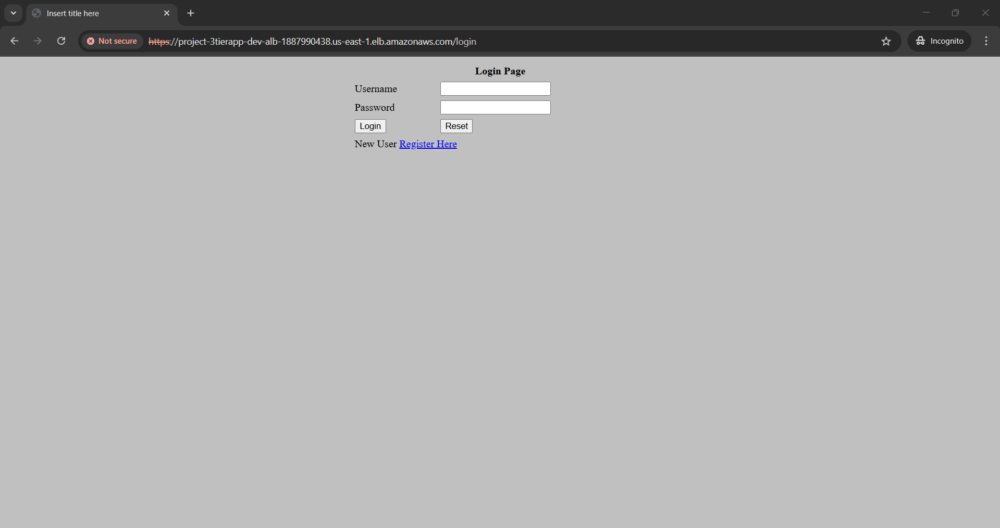

# AWS 3-Tier Architecture Deployment for a Scalable Java Application


## Project Overview
This project demonstrates the deployment of a **Java application** using a **3-tier architecture** on AWS. The architecture consists of:
- **Presentation Layer**: NGINX (Public Subnet)
- **Application Layer**: Java Application running on Tomcat (Private Subnet)
- **Database Layer**: Amazon RDS (Private Subnet)

The infrastructure is provisioned using **Terraform**, ensuring scalability, high availability, and automation.

---

## Technologies Used
- **AWS Services:** EC2, ALB, Route 53, RDS, VPC, Internet Gateway, Auto Scaling, NAT Gateway
- **Configuration Tools:** Terraform
- **Application Stack:** Java, Tomcat, MySQL
- **Web Server:** NGINX
- **Package Management:** Maven

---

## Deployment Steps

### 1. Create AMIs for NGINX and Java Application

#### **NGINX AMI Creation**
```sh
sudo apt update
sudo apt install nginx -y
sudo systemctl start nginx
```

Create the NGINX configuration file:
```sh
sudo vi /etc/nginx/sites-available/app.conf
```
Paste the following configuration:
```nginx
upstream app_servers {
    server 10.0.4.223:8080;
    server 10.0.3.23:8080;
}

server {
    listen 80;
    server_name _;
    location / {
        proxy_pass http://app_servers/dptweb-1.0/;
        proxy_set_header Host $host;
        proxy_set_header X-Real-IP $remote_addr;
        proxy_set_header X-Forwarded-For $proxy_add_x_forwarded_for;
        proxy_set_header X-Forwarded-Proto $scheme;
    }
}
```
Enable the configuration and restart NGINX:
```sh
sudo ln -s /etc/nginx/sites-available/app.conf /etc/nginx/sites-enabled
d
sudo systemctl restart nginx
```

#### **Java Application AMI Creation**
```sh
sudo apt update
sudo apt install openjdk-11 -y
tsudo apt install tomcat9 tomcat9-admin tomcat-common -y
sudo apt install maven -y
```

Edit Tomcat users:
```sh
sudo vi /etc/tomcat9/tomcat-users.xml
```
Paste the following user configuration:
```xml
<tomcat-users>
  <role rolename="manager-gui"/>
  <role rolename="admin-gui"/>
  <user username="admin" password="your_admin_password" roles="manager-gui,admin-gui"/>
</tomcat-users>
```
Restart Tomcat:
```sh
sudo systemctl restart tomcat9
sudo systemctl enable tomcat9
```

#### **Create AMIs**
After configuring both instances, create AMIs for NGINX and Java servers.

---

### 2. Deploy Infrastructure using Terraform

- Add the created AMI IDs in the Terraform modules for NGINX and the App.
- Deploy the infrastructure using Terraform:
```sh
tf init
tf apply -auto-approve
```

#### **Configure RDS Database**
1. SSH into the **Bastion Host**.
2. SSH into the **App Server** from the **Bastion Host**.
3. Connect to the **RDS Database**:
```sh
sudo mysql -h <RDS_Endpoint> -P 3306 -u <username> -p
```
4. Create and configure the database:
```sql
CREATE DATABASE UserDB;
USE UserDB;

CREATE TABLE Employee (
    id int unsigned auto_increment not null,
    first_name varchar(250),
    last_name varchar(250),
    email varchar(250),
    username varchar(250),
    password varchar(250),
    regdate timestamp,
    primary key (id)
);
```

#### **Update Application Properties**
Clone the repository and update `application.properties`:
```sh
git clone https://github.com/saurabhshende13/AWS-3-Tier-Architecture-Deployment-for-a-Scalable-Java-Application.git
cd AWS-3-Tier-Architecture-Deployment-for-a-Scalable-Java-Application/java-app/src/main/resources
vi application.properties
```
Modify the database connection details:
```properties
spring.datasource.url = jdbc:mysql://<RDS_Endpoint>:3306/UserDB
spring.datasource.username = <username>
spring.datasource.password = <password>
```

#### **Build and Package Java Application**
```sh
cd AWS-3-Tier-Architecture-Deployment-for-a-Scalable-Java-Application/java-app
mvn clean package
```
Artifact will be generated in `java-app/target/`.

#### **Deploy Application to Tomcat Server**
```sh
cd AWS-3-Tier-Architecture-Deployment-for-a-Scalable-Java-Application/java-app/target/
cp -r dptweb-1.0.war /var/lib/tomcat9/webapps/
cd /var/lib/tomcat9/webapps/
sudo chown -R tomcat:tomcat dptweb-1.0.war
sudo systemctl restart tomcat9
```

#### **Verify Deployment**
```sh
curl http://<app-server-private-IP>:8080/dptweb-1.0/
```

> **Note:** Once tested, create final AMIs for the App Server and NGINX.

#### **Final result from ALB DNS Name**



---

### 3. Configure Route 53 for Domain Mapping

- Create a **Route 53 record** with an **ALB alias**.


- Access the application using the domain name.


---

## Project Outcomes
✅ **Highly Available & Scalable** Java application deployment

✅ **Automated Infrastructure Provisioning** with Terraform

✅ **Secure Access** using Public & Private subnets with a Bastion Host

✅ **Efficient Load Balancing** using ALB & Auto Scaling

✅ **Optimized Database Management** with Amazon RDS Multi-AZ

---

## Next Steps
🔹 Implement **CI/CD Pipeline** with Jenkins & GitHub Actions
🔹 Integrate **Monitoring & Logging** using Prometheus, Grafana, and CloudWatch
🔹 Add **Security Enhancements** like IAM roles & WAF

---

## Author
**Saurabh Shende**

GitHub: [AWS-3-Tier-Architecture-Deployment](https://github.com/saurabhshende13/AWS-3-Tier-Architecture-Deployment-for-a-Scalable-Java-Application)

